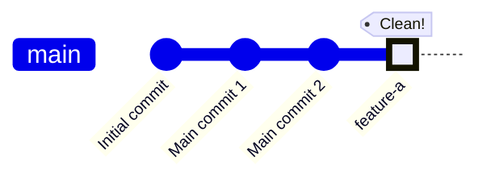
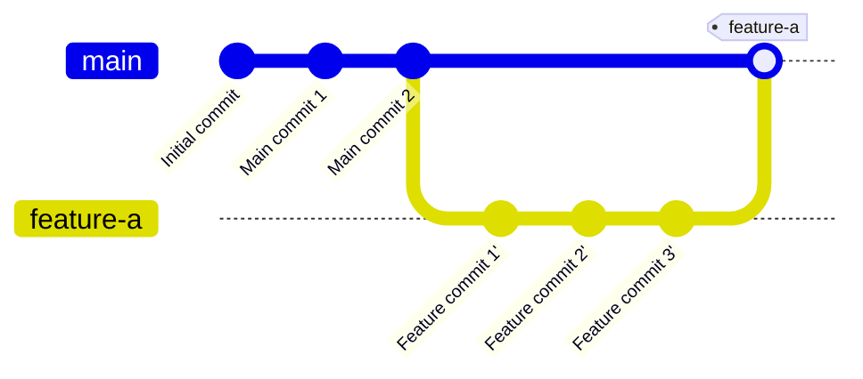

# Git Rebase and Merge Workflows

This folder contains step-by-step visual guides for professional git workflows that combine rebasing with two different merge strategies: **squash merge** (for clean history) and **no-fast-forward merge** (to preserve full history).

You should install a Mermaid extension or tool to make them easier to view.

## Workflow Overview

### Squash Merge Result (Clean & Linear)


### No-FF Merge Result (Preserves History)


## The Steps

### Squash Merge Workflow (Clean History)

1. **[Step 1: git fetch](step1_fetch.md)** - Fetch latest changes from remote
2. **[Step 2: git rebase main](step2_rebase.md)** - Replay feature commits on top of main
3. **[Step 3: git checkout main](step3_checkout.md)** - Switch to main branch
4. **[Step 4: git merge --squash feature-a](step4_squash.md)** - Squash all feature commits
5. **[Step 5: git commit -m "feature-a"](step5_commit.md)** - Create single clean commit

### No-Fast-Forward Merge Workflow (Preserve History)

1. **[Step 1: git fetch](step1_fetch.md)** - Fetch latest changes from remote
2. **[Step 2: git rebase main](step2_rebase.md)** - Replay feature commits on top of main
3. **[Step 3: git checkout main](step3_checkout.md)** - Switch to main branch
4. **[Step 4: git merge --no-ff feature-a](step4_no_ff.md)** - Merge with explicit merge commit

## Complete Command Sequence

### Option 1: Squash Merge (Clean History)
```bash
# Assuming you're on feature-a branch
git fetch                              # Get latest from remote
git rebase main                        # Rebase your commits on main
git checkout main                      # Switch to main
git merge --squash feature-a           # Squash feature commits
git commit -m "feature-a"              # Commit as single change
```

### Option 2: No-Fast-Forward Merge (Preserve History)
```bash
# Assuming you're on feature-a branch
git fetch                              # Get latest from remote
git rebase main                        # Rebase your commits on main
git checkout main                      # Switch to main
git merge --no-ff feature-a            # Merge with merge commit (auto-commits)
```

## Why Use This Workflow?

### Squash Merge Benefits:
✅ **Clean History** - Main branch has one commit per feature  
✅ **Linear Timeline** - No merge commit clutter  
✅ **Easy Rollback** - Revert entire features with one command  
✅ **Professional** - Easy to review and understand project history  
✅ **Simple Code Review** - Review entire feature as one unit

### No-Fast-Forward Merge Benefits:
✅ **Full History** - All development commits preserved  
✅ **Branch Visualization** - See which commits were part of which feature  
✅ **Audit Trail** - Complete development history for compliance  
✅ **Automatic Commit** - No manual commit step needed  
✅ **Better for Collaboration** - Team sees detailed development process

## Choosing Between --squash and --no-ff

| Factor                 | Use --squash         | Use --no-ff                |
| ---------------------- | -------------------- | -------------------------- |
| **History preference** | Clean, linear        | Detailed, complete         |
| **Commit quality**     | Has WIP commits      | Well-crafted commits       |
| **Project type**       | Product development  | Audited/regulated projects |
| **Team size**          | Any                  | Better for larger teams    |
| **Revert strategy**    | Revert single commit | Revert merge commit        |

## When NOT to Use These Workflows

❌ **Already pushed to shared branch** - Don't rebase public history  
❌ **Simple hotfixes** - Direct commit to main might be fine  
❌ **Working alone on personal project** - May be overkill  
❌ **Need both clean history AND commit details** - Document important commits in PR/merge message instead

**Note:** Never rebase commits that have been pushed to a shared/public branch. Rebasing rewrites history and will cause problems for collaborators.  

## Additional Resources

- [Git Branching Basics](../README.md)
- [Git Rebase Documentation](https://git-scm.com/docs/git-rebase)
- [Git Merge Squash Documentation](https://git-scm.com/docs/git-merge#Documentation/git-merge.txt---squash)
- [Git Merge No-FF Documentation](https://git-scm.com/docs/git-merge#Documentation/git-merge.txt---no-ff)
