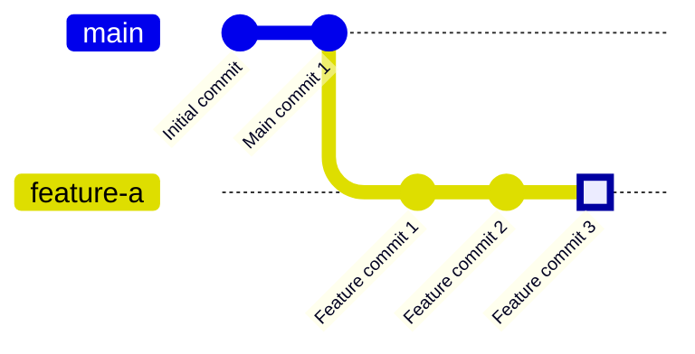
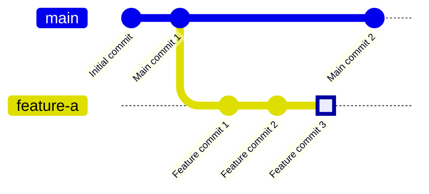

# Step 1: git fetch

Fetch the latest changes from the remote repository.

After fetching, main has new commits from remote:

**What happened?**
- `git fetch` downloaded the latest commits from the remote repository
- Your local `main` branch now knows about the new commits
- Your `feature-a` branch is still based on the old main
