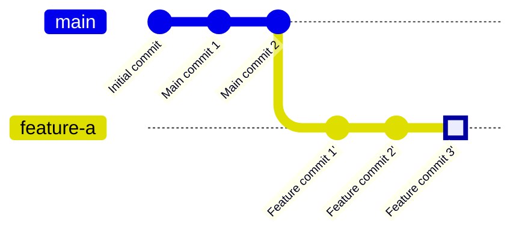

# Step 2: git rebase main

Replay your feature commits on top of the updated main branch.

**What happened?**
- `git rebase main` moved your feature commits to start from the tip of main
- Your commits got new identifiers (notice the `'` marks) because they were rewritten
- This creates a linear history without merge commits
- Your feature branch now includes all the latest changes from main

**Important Notes:**
- Rebasing rewrites commit history
- Never rebase commits that have been pushed to a shared branch
- Perfect for cleaning up local development before merging
