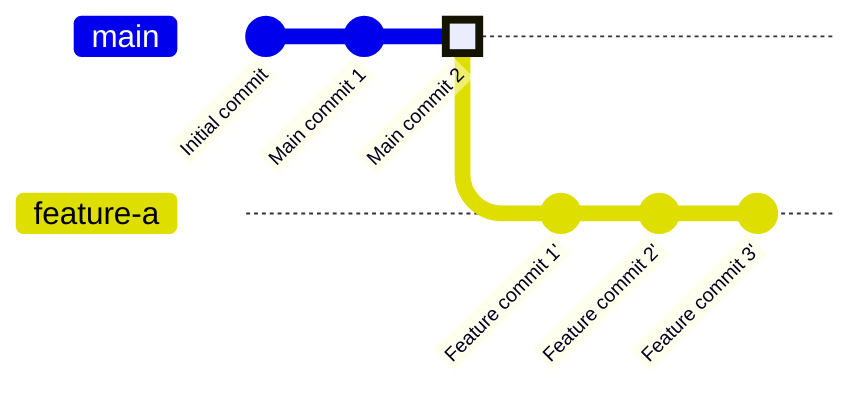

# Step 3: git checkout main

Switch back to the main branch to prepare for merging.

**What happened?**
- `git checkout main` switched your working directory to the main branch
- You're now positioned at the tip of main
- Ready to bring in the changes from feature-a

**Next Step:**
- Now you can merge the feature branch into main
