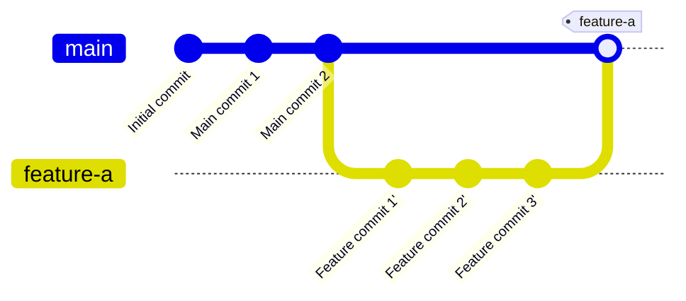

# Step 4 (Alternative): git merge --no-ff feature-a

Merge feature branch while preserving branch history with a merge commit.

**What happened?**
- `git merge --no-ff feature-a -m "feature-a"` creates a merge commit
- Preserves all individual commits from feature-a
- Creates a visual branch in the history
- Even if fast-forward is possible, forces a merge commit

**What's different from --squash?**
- `--no-ff` keeps all feature commits visible in history
- `--squash` combines all commits into one
- `--no-ff` creates a merge commit automatically
- `--squash` requires a manual commit after merging

**Benefits:**
- **Full history preserved** - Can see all development commits
- **Branch visualization** - Clear which commits were part of which feature
- **Automatic commit** - No need for manual commit step
- **Easy to revert** - Revert the merge commit to undo entire feature
- **Better for collaboration** - Team can see detailed development process

**Drawbacks:**
- More cluttered history than squash merge
- All "work in progress" commits remain visible
- Can make history harder to read with many features
