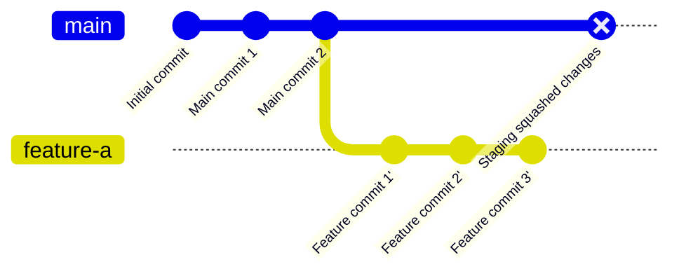

# Step 4: git merge --squash feature-a

Squash all feature commits into a single set of changes.

**What happened?**
- `git merge --squash feature-a` takes all changes from feature-a
- Combines them into a single set of staged changes
- Does NOT create a commit yet
- Does NOT preserve the individual commit history from feature-a

**What's in staging?**
- All the file changes from Feature commit 1', 2', and 3'
- Ready to be committed as one clean commit

**Benefits:**
- Clean main branch history
- One commit per feature
- Easy to revert entire features
- Easier to review the full feature changes
