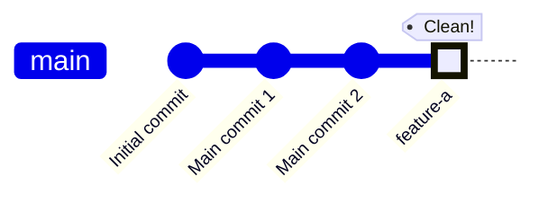

# Step 5: git commit -m "feature-a"

Create a single, clean commit on main with all the feature changes.

**What happened?**
- `git commit -m "feature-a"` created one commit with all the squashed changes
- The main branch now has a linear, clean history
- All the messy development commits from feature-a are gone from main's history
- The feature branch still exists (not shown) with its full history if you need it

**Result:**
✅ **Clean main branch** - One commit per feature  
✅ **Linear history** - No merge commit clutter  
✅ **Easy rollback** - Just revert one commit to remove the entire feature  
✅ **Professional** - Main branch is easy to read and review  

**Compare to regular merge:**
- Regular merge would show all 3 feature commits on main
- This squash merge shows just 1 clean commit
- Perfect for teams that want a clean main branch history

**When to use this workflow:**
- Working on a team that values clean history
- Feature has many small "work in progress" commits
- Want to make it easy to review changes as one unit
- Need to easily revert entire features
